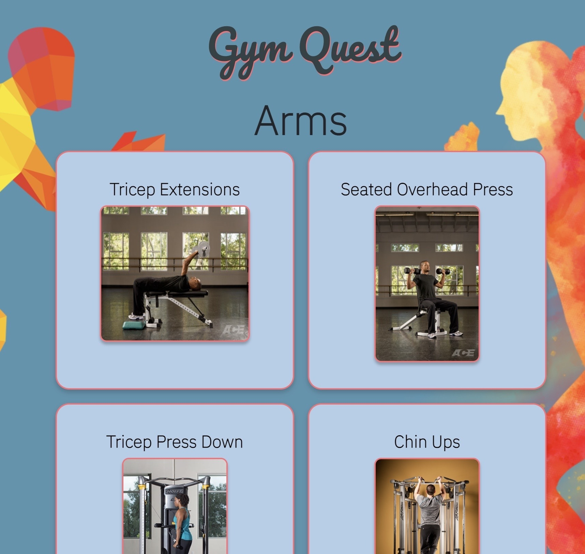
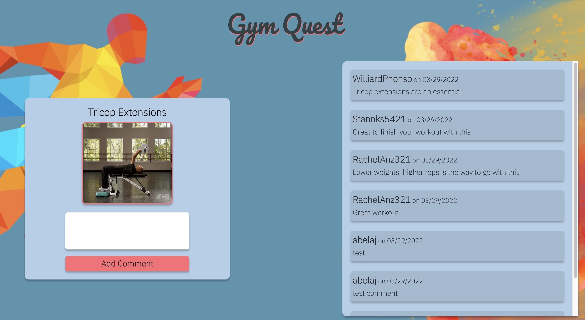

# GymQuest
  
  ## Table of Contents
  * [Description](#description)
  * [Installation](#installation)
  * [Usage](#usage)
  * [Contributing](#contributing)
  * [Images](#images)
  * [Video](#video)
  * [Questions](#questions)
  * [Credits](#credits)

  ## Description
  A fitness app created for those looking to start or add to their workout routines. Users are allowed to signup and login to use the site features such as workout categories, which are categorized by muscle group with a multitude of workouts available for each group. Users are also encouraged to comment on each workout. 
  
  https://gym-quest.herokuapp.com/

  ## Installation
  Clone the repository to your local machine and then install the following packages: express-handlebars, MySQL2, Sequelize, dotenv package, bcrypt package(this will hash the passwords), express-session connect-session-sequelize(this adds authentication). Source the schema.sql file via MySQL on the command line, then npm run seed, npm start(to run the server to port 3001), then open localhost:3001 in your browser. 

  ## Usage
  Fairly simple workout website with a signup/login form as well as workout categories. User can navigate through the categories and post comments to said categories. 

  
  ## Contributing
  Others can contribute by simply emailing any of the key contributors to the project and putting up any issues to the repo. 

  ## Images 
  

  
  
  
  
  

  ## Video

  https://drive.google.com/file/d/1fXD2N_DqxIUKsOTJrAsKrqB3e-l8iqlJ/view?usp=sharing

  ## Questions
  Have questions about this project?  
  GitHub: https://github.com/AlessandroB96/GymQuest 

  Members Github accounts:
  * Rafael Arias https://github.com/GeneHackerman 
  * Alessandro Belaj https://github.com/AlessandroB96/GymQuest 
  * Anthony Marrocco https://github.com/ajmarrocco
  * Francisco Alegria https://github.com/mralegria31

  ## Credits
  Rafael Arias, Alessandro Belaj, Anthony Marrocco, and Francisco Alegria
  
